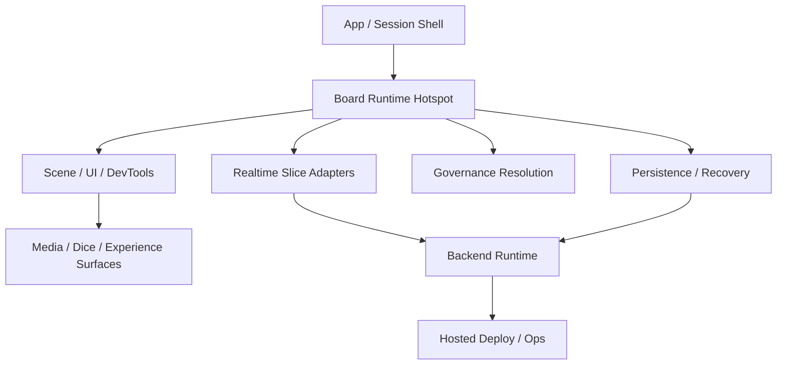
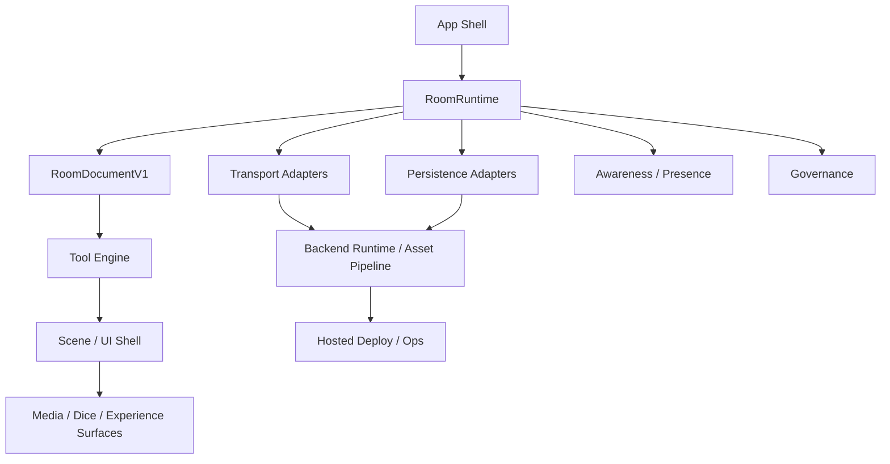

# Architecture Layer Map

Status: canonical layer map  
Date: 2026-04-20

Related docs:

- `docs/04_ARCHITECTURE/00_OVERVIEW/ARCHITECTURE.md`
- `docs/04_ARCHITECTURE/00_OVERVIEW/architecture-summary.md`
- `docs/04_ARCHITECTURE/01_RUNTIME/board-runtime-target-architecture.md`
- `docs/04_ARCHITECTURE/01_RUNTIME/board-runtime-staged-roadmap.md`
- `docs/04_ARCHITECTURE/02_DATA_AND_SYNC/room-memory-model.md`
- `docs/04_ARCHITECTURE/02_DATA_AND_SYNC/room-document-persistence-target-memo.md`
- `docs/04_ARCHITECTURE/03_GOVERNANCE/governance-model-design.md`

## 1. Роль документа

Этот документ даёт одну inspectable карту high-level архитектурных слоёв.

Он фиксирует:

- current architecture layers;
- target architecture layers;
- переход между ними;
- основные code/docs anchors для каждого слоя.

Этот документ не заменяет detailed runtime, data/sync, governance, ops и
product docs.
Он даёт верхний уровень навигации.

## 2. Как читать карту

Если нужен быстрый ответ:

1. открыть `architecture-summary.md`;
2. открыть раздел `Current layers` ниже;
3. открыть раздел `Target layers` ниже;
4. открыть `Layer transition map`, если нужен migration path.

Если нужен implementation-level context:

- runtime ownership и phased target: `01_RUNTIME/*`
- state categories, replicas, persistence: `02_DATA_AND_SYNC/*`
- governance: `03_GOVERNANCE/*`
- deploy/ops/validation: `05_OPERATIONS_AND_VALIDATION/*`

## 3. Current layers

### Layer 1. App / session shell

Purpose:

- route / room id;
- join / leave flow;
- participant session bootstrap;
- top-level feature and env gating.

Main code:

- `src/App.tsx`
- `src/app/*`

Current truth:

- shell is partially separated from board runtime;
- `App.tsx` still remains heavier than the final shell target.

Canonical docs:

- `docs/04_ARCHITECTURE/00_OVERVIEW/ARCHITECTURE.md`
- `docs/03_PRODUCT/01_FLOWS/room-behavior-spec.md`

### Layer 2. Board runtime hotspot

Purpose:

- current room-scoped runtime owner for board behavior;
- bootstrap and recovery wiring;
- object mutations;
- interaction state;
- render orchestration.

Main code:

- `src/components/BoardStage.tsx`
- `src/board/runtime/*`
- `src/board/viewModels/*`
- `src/board/components/*`

Current truth:

- `BoardStage` is still the main integration hotspot;
- render boundaries already started splitting out;
- room-open phase model still sits too close to this layer.

Canonical docs:

- `docs/04_ARCHITECTURE/00_OVERVIEW/ARCHITECTURE.md`
- `docs/04_ARCHITECTURE/01_RUNTIME/interaction-layer-design.md`

### Layer 3. Realtime slice adapters

Purpose:

- token/image/text-card shared transport;
- presence publication and receive;
- ephemeral remote hints.

Main code:

- `src/lib/roomTokensRealtime.ts`
- `src/lib/roomImagesRealtime.ts`
- `src/lib/roomTextCardsRealtime.ts`
- `src/lib/roomPresenceRealtime.ts`
- `src/lib/roomCreatorRealtime.ts`
- `src/board/sync/*`

Current truth:

- transport is physically split by slices;
- this works as an alpha bridge;
- product/runtime ownership still leaks into UI-side wiring.

Canonical docs:

- `docs/04_ARCHITECTURE/02_DATA_AND_SYNC/property-lww-sync-experiment-plan.md`
- `docs/04_ARCHITECTURE/02_DATA_AND_SYNC/shared-drawing-result-sync.md`

### Layer 4. Persistence / recovery

Purpose:

- local replica;
- durable snapshot;
- room identity;
- settled recovery and convergence.

Main code:

- `src/lib/storage.ts`
- `src/lib/durableRoomSnapshot.ts`
- `src/lib/roomOpsApi.ts`
- `.runtime-data/*`

Current truth:

- recovery model is already explicit and coherent for the current alpha;
- local and durable layers are still practical bridges, not the final mature
  document platform.

Canonical docs:

- `docs/04_ARCHITECTURE/02_DATA_AND_SYNC/room-memory-model.md`
- `docs/04_ARCHITECTURE/02_DATA_AND_SYNC/room-document-persistence-target-memo.md`
- `docs/04_ARCHITECTURE/02_DATA_AND_SYNC/room-document-replica-map.md`

### Layer 5. Governance

Purpose:

- room/object action classification;
- allow/deny resolution;
- inspectable runtime access state.

Main code:

- `src/lib/governance.ts`
- `src/lib/governancePolicy.ts`

Current truth:

- governance exists as a real runtime layer;
- policy surface is still intentionally narrow.

Canonical docs:

- `docs/04_ARCHITECTURE/03_GOVERNANCE/governance-model-design.md`
- `docs/04_ARCHITECTURE/03_GOVERNANCE/governance-runtime-design.md`

### Layer 6. Scene / UI / DevTools

Purpose:

- Konva scene;
- shell overlays;
- note editor and scene-attached HTML;
- Dev tools and inspectability UI.

Main code:

- `src/board/components/BoardStageScene.tsx`
- `src/board/components/BoardStageShellOverlays.tsx`
- `src/board/components/BoardStageDevToolsContent.tsx`
- `src/ui/*`
- `src/ui/system/*`

Current truth:

- render/UI split is already moving in the right direction;
- runtime ownership still sits higher in `BoardStage`.

Canonical docs:

- `docs/04_ARCHITECTURE/00_OVERVIEW/ARCHITECTURE.md`
- `docs/04_ARCHITECTURE/01_RUNTIME/board-object-interaction-model.md`
- `docs/04_ARCHITECTURE/01_RUNTIME/board-object-indication-matrix.md`

### Layer 7. Media / dice / experience surfaces

Purpose:

- optional LiveKit media layer;
- authoritative shared dice;
- experience surfaces that sit above the core board runtime.

Main code:

- `src/media/*`
- `src/dice/*`

Current truth:

- both are accepted alpha layers;
- neither should pull the project into a media platform or rules platform.

Canonical docs:

- `docs/03_PRODUCT/00_OVERVIEW/PRODUCT_FOUNDATION.md`
- `docs/05_OPERATIONS_AND_VALIDATION/01_LOCAL_DEV/livekit-local-dev.md`

### Layer 8. Backend runtime and hosted services

Purpose:

- realtime backend;
- room identity/snapshot routes;
- ops/admin/debug surfaces;
- token fallback path.

Main code:

- `scripts/yjs-dev-server.mjs`
- `api/livekit/token.ts`

Current truth:

- one practical alpha backend boundary;
- separate frontend host and optional separate LiveKit service.

Canonical docs:

- `docs/04_ARCHITECTURE/00_OVERVIEW/ARCHITECTURE.md`
- `docs/05_OPERATIONS_AND_VALIDATION/02_DEPLOYMENT/hosted-alpha-deployment-plan.md`

### Layer 9. Deploy / ops / validation

Purpose:

- local-dev workflows;
- hosted deploy assumptions;
- smoke and manual QA;
- runtime debugging discipline.

Main docs:

- `docs/05_OPERATIONS_AND_VALIDATION/*`

Current truth:

- this layer is operational rather than product-facing;
- it is still part of architecture inspectability because the hosted split is a
  real system boundary.

## 4. Target layers

### Layer 1. App shell

Purpose:

- route / room id;
- draft room selection;
- join / leave flow;
- participant session bootstrap;
- top-level env gating.

Target shift:

- `App.tsx` stops owning broader runtime logic;
- room-scoped runtime moves below this layer.

### Layer 2. RoomRuntime

Purpose:

- room lifecycle;
- room-open phases;
- transport attach lifecycle;
- local/durable replica orchestration;
- recovery decisions;
- room health and diagnostics.

Target shift:

- this becomes the main room-scoped orchestrator;
- `BoardStage` stops owning room-open state graph directly.

Canonical target docs:

- `docs/04_ARCHITECTURE/01_RUNTIME/board-runtime-target-architecture.md`
- `docs/04_ARCHITECTURE/01_RUNTIME/board-runtime-staged-roadmap.md`

### Layer 3. RoomDocumentV1

Purpose:

- typed shared-content contract;
- schema version;
- migrations;
- selectors;
- document commands.

Target shift:

- current broad `BoardObject` model gives way to typed record families;
- local and durable persistence read the same document contract.

Canonical target docs:

- `docs/04_ARCHITECTURE/01_RUNTIME/board-runtime-target-architecture.md`
- `docs/04_ARCHITECTURE/02_DATA_AND_SYNC/room-document-persistence-target-memo.md`

### Layer 4. Transport adapters

Purpose:

- realtime attach/detach;
- inbound/outbound room-document changes;
- transport status;
- room presence publication.

Target shift:

- current slice-based transport can stay physically separate at first;
- product-facing ownership moves under `RoomRuntime`.

### Layer 5. Persistence adapters

Purpose:

- local replica read/write;
- durable snapshot read/write;
- revision handoff;
- later document-level migration handling.

Target shift:

- persistence adapters stop competing as ad hoc truth sources;
- they serve one logical room-document contract.

### Layer 6. Awareness / presence

Purpose:

- cursors;
- participant activity;
- temporary locks;
- temporary remote previews;
- lightweight session hints.

Target shift:

- stays separate from persisted room content;
- remains explicitly ephemeral.

### Layer 7. Tool engine

Purpose:

- selection;
- viewport gestures;
- drag;
- transform;
- draw;
- note edit;
- interaction arbitration.

Target shift:

- cross-object behavior stops living inside render orchestration;
- tools talk to document commands and awareness helpers.

### Layer 8. Scene / UI shell

Purpose:

- Konva scene render;
- HTML overlays;
- shell panels;
- Dev tools UI.

Target shift:

- `BoardStage` becomes thin composition shell;
- render/UI layers consume runtime outputs rather than own them.

### Layer 9. Governance

Purpose:

- stable access model and policy resolution across room/document/actions.

Target shift:

- governance remains a separate cross-cutting layer;
- it plugs into room/document runtime instead of living inside local UI
  reasoning.

### Layer 10. Media / dice / experience surfaces

Purpose:

- optional higher-level experience layers above the core board/runtime spine.

Target shift:

- they keep their product role;
- they do not reshape the core room/runtime/document model.

### Layer 11. Backend runtime / asset pipeline / ops

Purpose:

- realtime backend;
- room identity and persistence services;
- asset upload and asset fetch path later;
- hosted deployment and operational boundaries.

Target shift:

- backend still stays practical and boring;
- asset pipeline joins this layer later;
- service split stays narrow and justified by real product/runtime need.

## 5. Layer transition map

### Current `BoardStage` hotspot

Current owner:

- room-open phase graph;
- recovery orchestration;
- transport wiring;
- board mutations;
- interaction logic;
- render composition.

Target split:

- room lifecycle and diagnostics -> `RoomRuntime`
- document contract -> `RoomDocumentV1`
- interaction ownership -> `Tool engine`
- render composition -> `Scene / UI shell`

### Current slice-based realtime

Current owner:

- `roomTokensRealtime`
- `roomImagesRealtime`
- `roomTextCardsRealtime`
- `roomPresenceRealtime`

Target split:

- keep adapters first;
- move room-facing ownership under `RoomRuntime`;
- revisit physical transport unification later.

### Current local + durable recovery

Current owner:

- local replica
- durable snapshot
- room identity
- settled recovery

Target split:

- keep current semantics now;
- serve one logical document contract later;
- keep awareness and UI state outside this layer.

## 6. Inspection routes

### Быстрый human route

1. `docs/04_ARCHITECTURE/00_OVERVIEW/architecture-summary.md`
2. `docs/04_ARCHITECTURE/00_OVERVIEW/architecture-layer-map.md`
3. `docs/04_ARCHITECTURE/00_OVERVIEW/ARCHITECTURE.md`

### Agent route for current runtime truth

1. `docs/04_ARCHITECTURE/00_OVERVIEW/architecture-layer-map.md`
2. `docs/04_ARCHITECTURE/00_OVERVIEW/ARCHITECTURE.md`
3. `docs/04_ARCHITECTURE/02_DATA_AND_SYNC/room-memory-model.md`
4. focused runtime/data/governance doc for the touched layer

### Agent route for target architecture and migration

1. `docs/04_ARCHITECTURE/00_OVERVIEW/architecture-layer-map.md`
2. `docs/04_ARCHITECTURE/01_RUNTIME/board-runtime-target-architecture.md`
3. `docs/04_ARCHITECTURE/01_RUNTIME/board-runtime-staged-roadmap.md`
4. `docs/04_ARCHITECTURE/02_DATA_AND_SYNC/room-document-persistence-target-memo.md`

## 7. Decision rule

When current and target differ:

- current behavior and current implementation decisions follow current-state and
  accepted current architecture docs;
- target docs define the direction and migration order;
- active chapters may absorb only the slices explicitly promoted in roadmap/current-context.
